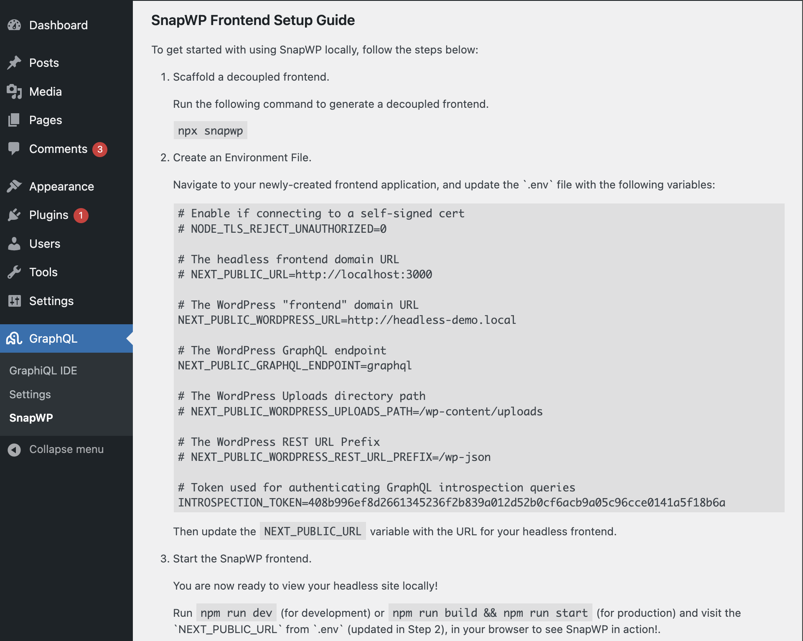

# Getting Started

This guide will walk you through setting up a headless WordPress app using SnapWP.

## Backend Setup

### Prerequisites

-   **PHP**: v7.4+
-   **WordPress**: v6.7+
-   A **[Block Theme](https://wordpress.org/documentation/article/block-themes/)**

### Installation Steps

1. Install and activate the latest release versions of the following plugins:

    - [WPGraphQL](https://wordpress.org/plugins/wp-graphql/)
    - [WPGraphQL Content Blocks](https://github.com/wpengine/wp-graphql-content-blocks/releases/latest)
    - [SnapWP Helper](https://github.com/rtCamp/snapwp-helper/releases/latest)

    **With WP-CLI**:

    You can install the latest versions of the required plugins using the WP-CLI command below:

    ```bash
    wp plugin install wp-graphql https://github.com/wpengine/wp-graphql-content-blocks/releases/latest/download/wp-graphql-content-blocks.zip https://github.com/rtCamp/snapwp-helper/releases/latest/download/snapwp-helper.zip --activate
    ```

2. (Optional) If you're running your WordPress site on a different domain than your frontend, you may need to [configure CORS headers](./cors.md).

## Frontend Setup

### Prerequisites

-   **Node.js**: v20+ (with `npm` and `npx` installed).
-   **A WordPress backend** configured with SnapWP Helper (see [previous section](#backend-setup)).

### Installation Steps

To create a new headless WordPress app using SnapWP, follow these steps:

1. Run the scaffolding wizard:

    ```bash
    npx snapwp
    ```

2. Answer the CLI prompts:

    1. Enter the path to the directory where you want to create the app, e.g. `./my-headless-app`
    2. Create an Environment File:

        1. Paste the .env contents from `Dashboard > WPGraphQL > Settings > SnapWP Helper` into the file created.

         <a href="./images/snapwp-helper-env.png">
           <figure>
             <!--@todo: link to snapwp-helper repo for image-->
             
             <br />
             <figcaption> Example environment variables from SnapWP Helper plugin screen. (Click for full screen)</figcaption>
           </figure>
         </a>

        2. Adjust any [environment variables as needed](./config-api.md#environment-variables).
        3. Save the file and close the editor.

    3. Return to the terminal and press `Enter` to continue the setup process.

3. Start your headless WordPress app:
    1. Navigate to the newly created app.
    2. Run `npm install`.
    3. Run `npm run dev` (for development) or `npm run build && npm run start` (for production)
    4. Visit the `NEXT_PUBLIC_URL` from `.env` (updated in Step 2), in your browser to see SnapWP in action!

### Manual Installation

1. Install npm packages in your Next App
```bash
npm i @snapwp/blocks @snapwp/core @snapwp/next @snapwp/query
```

2. Copy the .env contents from `Dashboard > WPGraphQL > Settings > SnapWP Helper` from the WP server and create an `.env` file in the project root.

3. Create `snapwp.config.ts` in the project root with the following content.
```typescript
import type { SnapWPConfig } from '@snapwp/core/config';

const config: SnapWPConfig = {};

export default config;

```

4. Create the default route at the path `src/app/[[...path]]/page.tsx`. Use the `TemplateRenderer` and `EditorBlocksRenderer` to create the route.

```typescript
import { TemplateRenderer } from '@snapwp/next';
import { EditorBlocksRenderer } from '@snapwp/blocks';

export default function Page() {
	return (
		<TemplateRenderer>
			{ ( editorBlocks ) => {
				return <EditorBlocksRenderer editorBlocks={ editorBlocks } />;
			} }
		</TemplateRenderer>
	);
}

```

5. Create the root layout to load global styles, fonts and scripts from WP server. Make a file `src/app/layout.tsx`

```typescript
import { RootLayout } from '@snapwp/next';

export default function Layout( { children }: { children: React.ReactNode } ) {
	return (
		<RootLayout>
			<>{ children }</>
		</RootLayout>
	);
}
```

6. Update the nextjs config. Rename the file to `next.config.mjs` so that top-level await can be used.

```javascript
import withSnapWP from '@snapwp/next/withSnapWP';

export default await withSnapWP( {} );
```

7. Check if you are using webpack for dev builds. Currently we don't support turbopack for dev builds. Remove the flag `--turbopack` to opt-out of using turbopack.  

```diff
...
  "scripts": {
-    "dev": "next dev --turbopack",
+    "dev": "next dev",
    ...
  },
...
```

### Deployment

@todo

### Troubleshooting

If you encounter issues, check the [GitHub Issues](https://github.com/rtCamp/snapwp/issues) for known problems and workarounds.

## Additional Resources

This section contains a list of curated resources for developers working with headless WordPress, WPGraphQL, and some of the technologies used in the SnapWP stack.

### WPGraphQL

-   **Docs**: [https://www.wpgraphql.com/docs/introduction](https://www.wpgraphql.com/docs/introduction)
-   **Official Discord Community**: [https://wpgraphql.com/discord/](https://wpgraphql.com/community/)

### Next.js

-   **Docs**: [https://nextjs.org/docs](https://nextjs.org/docs)

### TypeScript

-   **Docs**: [https://www.typescriptlang.org/docs/](https://www.typescriptlang.org/docs/)
